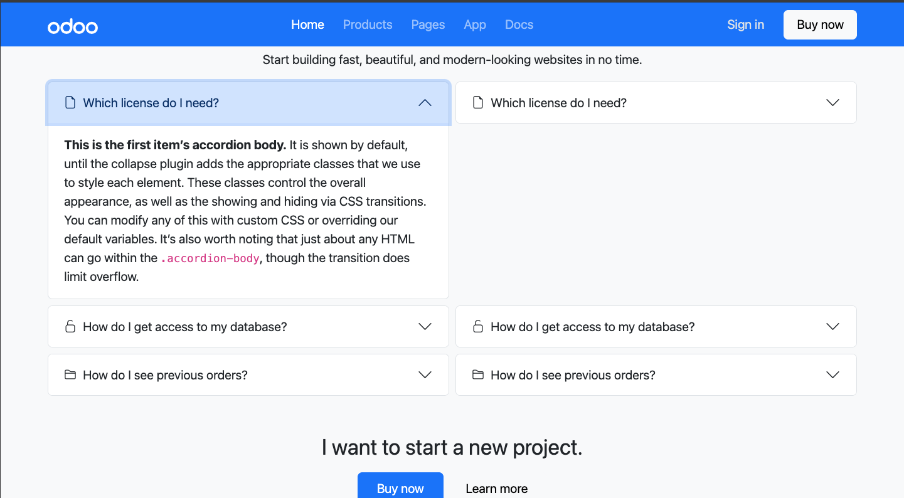

# Convert a mock-up into a static HTML page

## desktop preview

- 
- 
- 

## mobile preview

- 
- 
- 

## the brief

Convert this mock-up into a static HTML page.

The full-size image is available here:
mock-up.jpg

Texts and images are available here:
Texts & Images

To build the page, use Bootstrap (v5.3),
CSS (preferably SCSS) and JavaScript if needed.
Introduction · Bootstrap v5.3
Use as many Bootstrap variables as possible,
and SCSS maps.
Customize · Bootstrap v5.3

The final result should look correct on both desktop and mobile devices.
It doesn’t have to be a pixel-perfect copy.
Feel free to adapt the layout/design.

Navbar menu should be functional and responsive. It should show a hamburger menu on small devices. Feel free to modify it to link each item to a section on the site.

In the “Awards” section, the 5 boxes should be clickable with a hover effect.

The “Helpful answers” section contains an accordion. It should be fully functional.

Don’t hesitate to include comments and notes.
What do you find good/bad in this mock-up?
What would you improve?
What would you change?

When you’re done, publish your code on GitHub.

Happy coding :smiley:

